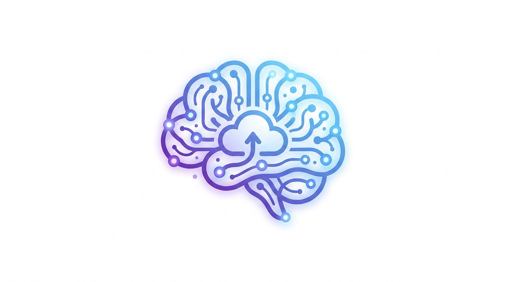
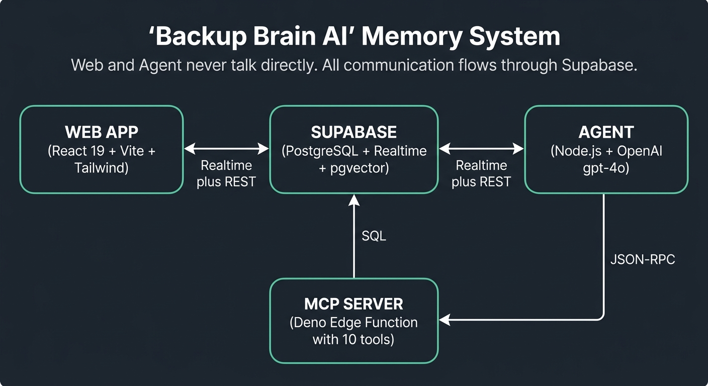

<p align="center">
  
</p>

<h1 align="center">Backup Brain</h1>

<p align="center">
  <strong>An AI memory system that captures, organizes, and recalls your thoughts through natural conversation.</strong>
</p>

<p align="center">
  <a href="#features">Features</a> &bull;
  <a href="#architecture">Architecture</a> &bull;
  <a href="#getting-started">Getting Started</a> &bull;
  <a href="#usage">Usage</a> &bull;
  <a href="#tech-stack">Tech Stack</a> &bull;
  <a href="#project-structure">Project Structure</a> &bull;
  <a href="#contributing">Contributing</a>
</p>

---

## What is Backup Brain?

Backup Brain is a chat interface backed by an autonomous AI agent that extracts information from your conversations, synthesizes it into searchable "thoughts," classifies them, and recalls relevant context through semantic search. No forms, no manual tagging — just talk to it.

You tell it things. It remembers them. When you need something back, it finds it by meaning, not keywords.

## Features

- **Zero-friction capture** — No forms or manual entry. Just chat naturally and the agent extracts and synthesizes your thoughts.
- **AI-powered synthesis** — Thoughts aren't raw messages. The agent distills and structures information into standalone, searchable units.
- **Semantic search** — Find things by meaning using vector embeddings (pgvector), not exact keyword matches.
- **Auto-classification** — Thoughts are automatically categorized, tagged, and entities are extracted with confidence scores.
- **Explainable decisions** — Every classification comes with reasoning you can review, accept, or correct.
- **Learning loop** — The agent reads your past corrections and improves its future decisions.
- **Automatic reminders** — Time-sensitive information is detected and surfaced as notifications when due.
- **Proactive insights** — A scheduled reviewer periodically resurfaces and re-evaluates thoughts, grouping related items and generating insights.
- **Multi-user** — Multiple users can share the same brain with full read/write access.
- **MCP-compatible** — The tool server uses the [Model Context Protocol](https://modelcontextprotocol.io/), making it pluggable with other AI clients.

## Architecture

<p align="center">
  
</p>

The system is a **pnpm monorepo** with three packages plus Supabase infrastructure. Web and Agent never communicate directly — all data flows through Supabase as the shared bus.

**How a message flows:**

1. User sends a message in the **Web App**
2. Message is written to `chat_messages` in **Supabase**
3. **Agent** picks it up via Realtime subscription
4. Agent reasons about the message using a **ReAct loop** (reason &rarr; act &rarr; respond)
5. Agent calls **MCP tools** (capture thought, classify, search, etc.) via JSON-RPC
6. Agent writes its response back to `chat_messages`
7. **Web App** receives the response via Realtime

### Key Design Decisions

| Decision                                  | Rationale                                                                                                         |
| ----------------------------------------- | ----------------------------------------------------------------------------------------------------------------- |
| Supabase as shared bus                    | Full decoupling between web and agent; works identically in local dev and cloud                                   |
| Thoughts are synthesized, not raw         | Agent-distilled units are more searchable and meaningful than raw chat messages                                   |
| Decisions are first-class entities        | Each classification, entity, reminder, tag, and todo is stored with confidence, reasoning, and correction history |
| Auto-settle everything                    | Zero friction by default; review is optional for users who want control                                           |
| Sequential per session, concurrent across | Prevents interleaving within a conversation while maximizing throughput                                           |

## Getting Started

### Prerequisites

- [Docker](https://www.docker.com/) (for local Supabase)
- [mise](https://mise.jdx.dev/) (manages Node 22, Deno 2, pnpm 10, Supabase CLI)
- [go-task](https://taskfile.dev/) (task runner)
- An [OpenAI API key](https://platform.openai.com/api-keys)

### Setup

```bash
# Install tool versions via mise
mise install

# Install dependencies
task install

# Start local Supabase (Postgres, Auth, Realtime, Studio)
task db:start

# Write .env files from local Supabase keys
task env

# Apply database migrations
task db:reset
```

Add your OpenAI API key to `.env` at the monorepo root:

```
OPENAI_API_KEY=sk-...
```

### Run

```bash
# Start all dev servers (web + agent + edge functions)
task dev
```

| Service         | URL                                     |
| --------------- | --------------------------------------- |
| Web App         | http://localhost:5173                   |
| Supabase Studio | http://localhost:54323                  |
| Agent Health    | http://localhost:3001                   |
| MCP Server      | http://localhost:54321/functions/v1/mcp |

## Usage

Once running, open the web app and sign in. Start a conversation and tell it anything:

> "We need to replace the roof before winter. Got a quote from ABC Roofing for $12k."

The agent will:

- Capture a thought about the roof replacement
- Classify it under a category (e.g., Home Maintenance)
- Extract entities (ABC Roofing)
- Detect the time sensitivity (before winter)
- Tag it appropriately

Later, ask:

> "What was that roofing quote?"

The agent searches by meaning and retrieves the relevant thought, even if you don't use the exact same words.

### Commands Reference

```bash
task install              # Install dependencies
task dev                  # Start all dev servers
task dev:stop             # Kill all dev servers
task typecheck            # Type-check all packages
task lint                 # Lint all packages
task test                 # Run all tests
task test:agent           # Agent tests (Vitest)
task test:web             # Web tests (Vitest)
task test:mcp             # MCP integration tests (Deno)
task test:integration     # End-to-end tests (Playwright)
task env                  # Write .env from local Supabase status
task db:start             # Start local Supabase
task db:stop              # Stop local Supabase
task db:reset             # Reset database
task db:dashboard         # Open Supabase Studio
```

Run a single test file:

```bash
pnpm -C packages/agent exec vitest run src/some-file.test.ts
```

## Tech Stack

| Layer          | Technology                                                          |
| -------------- | ------------------------------------------------------------------- |
| **Frontend**   | React 19, Vite 8, Tailwind CSS 4, React Router 7, TanStack Query    |
| **Agent**      | Node.js 22, OpenAI SDK (gpt-4o), node-cron                          |
| **MCP Server** | Deno 2, Hono, Zod, Supabase Edge Functions                          |
| **Database**   | PostgreSQL 17, pgvector (1536-dim embeddings), Supabase Realtime    |
| **Embeddings** | OpenAI text-embedding-3-small                                       |
| **Infra**      | AWS (S3 + CloudFront for web, App Runner for agent), Supabase Cloud |
| **Dev Tools**  | pnpm 10, mise, go-task, Vitest, Prettier, Husky, GitHub Actions     |

### MCP Tools

The MCP server exposes 10 tools via JSON-RPC:

| Tool                  | Purpose                                    |
| --------------------- | ------------------------------------------ |
| `capture_thought`     | Create a thought with decisions atomically |
| `update_thought`      | Modify thought content and re-embed        |
| `search_thoughts`     | Semantic similarity search                 |
| `list_thoughts`       | Browse/filter thoughts                     |
| `create_decision`     | Add a decision to a thought                |
| `update_decision`     | Accept, correct, or patch a decision       |
| `list_decisions`      | Query decisions with filters               |
| `create_group`        | Create a thought group                     |
| `create_notification` | Surface a reminder/suggestion/insight      |
| `set_session_title`   | Set chat session title                     |

## Project Structure

```
backup-brain/
├── packages/
│   ├── web/                # React + Vite frontend
│   │   └── src/
│   │       ├── app/        # App shell, routes, layouts, page wrappers
│   │       ├── features/   # auth, chat, decisions, notifications, reminders
│   │       └── shared/     # Reusable UI primitives, Supabase client, utilities
│   ├── agent/              # Node.js agent process
│   │   └── src/
│   │       ├── index.ts              # Entry point
│   │       ├── react-loop-executor.ts # ReAct loop (reason → act → respond)
│   │       ├── mcp-client.ts         # JSON-RPC client for MCP tools
│   │       ├── scheduler.ts          # Reminder checker + proactive reviewer
│   │       ├── session-lock.ts       # Per-session concurrency control
│   │       └── prompts/system.md     # Agent system prompt
│   └── shared/             # Shared TypeScript types
├── supabase/
│   ├── functions/mcp/      # Deno Edge Function (MCP server)
│   └── migrations/         # SQL schema migrations
├── Taskfile.yml            # Task runner config
├── .mise.toml              # Tool version management
├── ARCHITECTURE.md         # Full system design document
└── CLAUDE.md               # Claude Code instructions
```

## Environment Variables

### Agent

| Variable                    | Required | Description                       |
| --------------------------- | -------- | --------------------------------- |
| `SUPABASE_URL`              | Yes      | Supabase project URL              |
| `SUPABASE_SERVICE_ROLE_KEY` | Yes      | Service role key (bypasses RLS)   |
| `OPENAI_API_KEY`            | Yes      | OpenAI API key                    |
| `MCP_URL`                   | No       | MCP server URL (default: local)   |
| `HEALTH_PORT`               | No       | Health check port (default: 3001) |

### Web

| Variable                 | Required | Description            |
| ------------------------ | -------- | ---------------------- |
| `VITE_SUPABASE_URL`      | Yes      | Supabase project URL   |
| `VITE_SUPABASE_ANON_KEY` | Yes      | Supabase anonymous key |

## Database

PostgreSQL 17 with the **pgvector** extension for semantic search. Key tables:

| Table               | Purpose                                                                  |
| ------------------- | ------------------------------------------------------------------------ |
| `chat_sessions`     | Conversation sessions                                                    |
| `chat_messages`     | Messages (user and assistant)                                            |
| `thoughts`          | Agent-synthesized memories with 1536-dim vector embeddings               |
| `thought_decisions` | Classifications, entities, reminders, tags, todos with confidence scores |
| `thought_groups`    | Clusters of related thoughts                                             |
| `notifications`     | Reminders, suggestions, and insights                                     |
| `agent_state`       | Key-value store for agent process state                                  |

Similarity search is powered by the `match_thoughts()` PL/pgSQL function using cosine distance.

## Contributing

1. Fork the repository
2. Create a feature branch (`git checkout -b feature/my-feature`)
3. Make your changes
4. Run checks: `task typecheck && task test`
5. Commit and push
6. Open a pull request

## License

This project is private and not yet licensed for public use.
